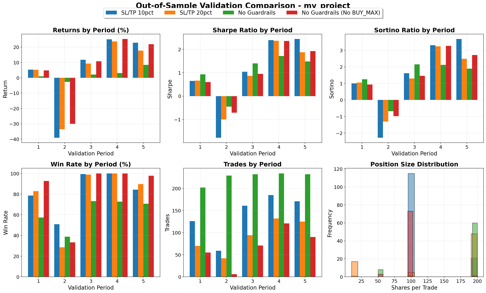

# DQN Trading System - Production-Grade Deep Reinforcement Learning for Stock Trading

A professional implementation of Deep Q-Network (DQN) for stock trading with Double DQN, Dueling architecture, intelligent position sizing, and comprehensive risk management.

## Table of Contents

1. [Executive Summary](#executive-summary)
2. [Quick Start](#quick-start)
3. [Project Structure](#project-structure)
4. [Configuration System](#configuration-system)
5. [Storage Structure](#storage-structure)
6. [Core Trading Mechanics](#core-trading-mechanics)
7. [Reward System Design](#reward-system-design)
8. [DQN Architecture](#dqn-architecture)
9. [Data Pipeline](#data-pipeline)
10. [Training Pipeline](#training-pipeline)
11. [Performance Monitoring](#performance-monitoring)
12. [Results & Metrics](#results--metrics)
13. [Advanced Usage](#advanced-usage)
14. [Technical References](#technical-references)

---

## Executive Summary

### What This System Does
This system trains an AI agent to make stock trading decisions (Buy/Hold/Sell) with variable position sizing (1-N shares) using Deep Reinforcement Learning. The agent learns to maximize absolute profit while managing risk through stop-loss and take-profit mechanisms.

### Key Differentiators
- **Absolute Profit Rewards**: Unlike naive implementations using percentage returns, our reward function uses absolute profit to properly incentivize position sizing
- **Variable Position Sizing**: Agent learns to buy 1 to MAX_SHARES based on market conditions
- **Smart Data Caching**: Intelligent caching system prevents redundant API calls
- **Production Quality**: Comprehensive monitoring, logging, and configuration management

### Core Capabilities
| Feature | Description |
|---------|-------------|
| **Position Sizing** | Buy 1 to N shares per trade (configurable) |
| **Risk Management** | Stop-loss (20%) and take-profit (20%) guardrails |
| **Architecture** | Double DQN with Dueling networks |
| **Action Masking** | Prevents invalid actions (can't buy when holding) |
| **Data Features** | 25+ technical indicators with rolling normalization |
| **Validation** | Out-of-sample validation on random non-overlapping periods |

---

## Quick Start

### 1. Fastest Test (< 1 minute)
```bash
# Install and run dry test
pip install -r requirements.txt
jupyter notebook main.ipynb

# In notebook:
# - Set PROJECT_FOLDER = 'dry_run'
# - Set TEST_MODE = False
# - Run all cells (Cell → Run All)
```

### 2. Monitor Training (Live)
```bash
# In another terminal while training:
python monitor_training.py --run <run_name>

# Output:
# 🔄 LIVE TRAINING MONITOR - dry_run_SPY_20260118_094530
# ⏱️  Runtime: 15.3 minutes
# 📈 Episode 45/100
#   • Return: $12,340 (12.34%)
#   • Win Rate: 55.23%
```

### 3. Full Training (30-60 minutes)
```bash
# In notebook:
PROJECT_FOLDER = 'default_run'  # 100 episodes, 10 years data
TEST_MODE = False  # Train from scratch
```

### 4. Test Mode (skip training if models exist)
```bash
# In notebook:
PROJECT_FOLDER = 'default_run'
TEST_MODE = True  # Load existing models for testing only
```

---

## Project Structure

### Configuration Folders
```
config/
├── dry_run/                      # Quick test project (1 episode, 2 years data)
│   ├── data_config.json         # Data settings (ticker, dates, splits)
│   └── trading_dry_run.json     # Strategy config with strategy_name
└── default_run/                  # Full training project (100 episodes, 10 years)
    ├── data_config.json
    └── trading_baseline.json
```

### Source Code Organization
```
src/
├── data/
│   ├── collector.py         # Smart caching - downloads once, reuses cached data
│   └── splitter.py          # Train/validation/test splitting
├── features/
│   ├── engineer.py          # 25+ technical indicators
│   └── normalizer.py        # Rolling Z-score normalization
├── models/
│   ├── dqn.py              # TensorFlow/Keras Double DQN + Dueling
│   └── action_masking.py   # Prevents invalid trades
├── trading/
│   ├── environment.py      # OpenAI Gym-style trading env
│   └── guardrails.py       # Stop-loss & take-profit
├── training/
│   ├── trainer.py          # Training orchestration
│   └── replay_buffer.py    # Experience replay
├── evaluation/
│   ├── validator.py        # Out-of-sample validation
│   └── metrics.py          # Performance metrics
└── utils/
    ├── config_loader.py    # Loads & validates configs
    └── model_manager.py    # TensorFlow model saving/loading
```

---

## Configuration System

📚 **[Complete Configuration Parameters Reference → CONFIG_PARAMETERS.md](CONFIG_PARAMETERS.md)**

### Two-Part Configuration Structure

Each project folder contains:
1. **`data_config.json`** - Data-related settings (shared across strategies)
2. **`trading_*.json`** - Strategy-specific settings

#### Example `data_config.json`:
```json
{
  "ticker": "SPY",
  "start_date": "2024-01-01",
  "end_date": "2025-12-31",
  "data": {
    "window_size": 5,
    "normalization_window": 30,
    "indicators": {
      "bollinger_period": 20,
      "rsi_period": 14,
      // ... more indicators
    }
  },
  "validation": {
    "n_periods": 2,
    "period_unit": "month",
    "random_seed": 42
  },
  "test": {
    "period_duration": 2,
    "period_unit": "month"
  }
}
```

#### Example `trading_*.json`:
```json
{
  "experiment_name": "baseline",
  "strategy_name": "Baseline (20% SL/TP)",  // Used in plot legends
  "trading": {
    "max_shares": 10,
    "starting_balance": 100000,
    "stop_loss_pct": 20,
    "take_profit_pct": 20
  },
  "network": {
    "architecture": "dueling",
    "shared_layers": [256, 128]
  },
  "training": {
    "episodes": 100,
    "save_frequency": 10,  // Save model every 10 episodes
    "learning_rate": 0.001
  }
}
```

---

## Storage Structure

### Models (TensorFlow .h5 files)
```
models/
├── dry_run/
│   └── dry_run/                  # {project}/{experiment_name}
│       ├── model_episode_001.h5  # Checkpoint (based on save_frequency)
│       ├── final_model.h5        # Final model
│       └── metadata.json         # Training info
└── default_run/
    └── baseline/
        ├── model_episode_010.h5  # Saved every 10 episodes
        ├── model_episode_020.h5
        ├── ...
        └── final_model.h5
```

**Model Saving Frequency:**
- Controlled by `save_frequency` in trading config
- `dry_run`: Every 1 episode (only has 1 episode)
- `default_run`: Every 10 episodes
- Final model always saved at end

### Results
```
results/
├── dry_run/
│   └── run_20260118_094530/     # Timestamped run folder
│       ├── final_results.json   # All metrics and history
│       ├── figure_*.png         # All plots
│       └── test_comparison.csv  # Strategy comparison table
└── default_run/
    └── run_20260118_103045/
        └── ...
```

### Logs (Real-time monitoring)
```
logs/
├── dry_run/
│   └── dry_run_SPY_20260118_094530/
│       ├── progress.json        # Training stages
│       └── metrics.json         # Episode metrics
└── default_run/
    └── ...
```

### Data Cache (Shared across all projects)
```
data/
├── SPY_20240101_20251231.csv   # Downloaded once, reused
└── VIX_20240101_20251231.csv   # Smart caching prevents redundant downloads
```

**Smart Caching Features:**
- First run: Downloads from Yahoo Finance
- Subsequent runs: Detects cache, prints "Using cached data"
- Cache key: `{TICKER}_{YYYYMMDD}_{YYYYMMDD}.csv`
- Automatic date range detection

---

## Creating Custom Projects

### Step 1: Create Project Folder
```bash
mkdir config/my_project
```

### Step 2: Create Data Config
```json
# config/my_project/data_config.json
{
  "ticker": "AAPL",
  "start_date": "2020-01-01",
  "end_date": "2024-12-31",
  "data": {
    "window_size": 5,
    "normalization_window": 30,
    "indicators": { ... }
  },
  "validation": {
    "n_periods": 3,
    "period_unit": "year"
  },
  "test": {
    "period_duration": 1,
    "period_unit": "year"
  }
}
```

### Step 3: Add Trading Strategies
You can add multiple trading strategies to compare:

```json
# config/my_project/trading_aggressive.json
{
  "experiment_name": "aggressive",
  "strategy_name": "Aggressive (10% SL, 30% TP)",
  "trading": {
    "max_shares": 100,
    "share_step": 10,
    "stop_loss_pct": 10,
    "take_profit_pct": 30,
    ...
  }
}

# config/my_project/trading_conservative.json
{
  "experiment_name": "conservative",
  "strategy_name": "Conservative (30% SL, 10% TP)",
  "trading": {
    "max_shares": 100,
    "share_step": 10,
    "stop_loss_pct": 30,
    "take_profit_pct": 10,
    ...
  }
}
```

### Step 4: Run in Notebook
```python
PROJECT_FOLDER = 'my_project'
TEST_MODE = False
# Run all cells - will train and compare both strategies
```

---

## Core Trading Mechanics

### Action Space

The agent's action space is determined by `max_shares` and `share_step` configuration:

**Formula:** `n_actions = (max_shares / share_step) + 2`

| max_shares | share_step | Actions | Description |
|------------|------------|---------|-------------|
| 10 | 1 | 12 | Hold(0), Buy1(1), Buy2(2)...Buy10(10), Sell(11) |
| 10 | 2 | 7 | Hold(0), Buy2(1), Buy4(2)...Buy10(5), Sell(6) |
| 100 | 10 | 12 | Hold(0), Buy10(1), Buy20(2)...Buy100(10), Sell(11) |
| 100 | 1 | 102 | Hold(0), Buy1(1)...Buy100(100), Sell(101) |

**Benefits of using share_step > 1:**
- Dramatically reduces action space (e.g., 102 actions → 12 actions)
- Faster training convergence
- Less memory for replay buffer
- Simpler Q-value learning

### Trading Rules

1. **Position Management**
   - Can only buy when NOT holding any shares
   - Must sell ALL shares at once (no partial sells)
   - Invalid actions are masked during training

2. **Risk Controls**
   - **Stop-Loss (20% default)**: Auto-sell if position drops 20%
   - **Take-Profit (20% default)**: Auto-sell if position gains 20%
   - **Transaction Costs (0.1%)**: Applied on both buy and sell

3. **State Representation**
   ```python
   State Shape: (window_size, n_features + 2)
   - Features: 25 technical indicators (normalized)
   - Position: shares_held / max_shares
   - Balance: current_balance / starting_balance
   ```

---

## Reward System Design

### Critical Design Choice: Absolute vs Percentage Rewards

**Why Absolute Rewards Matter:**

Consider two scenarios with 10% profit:
- Buy 1 share at $100, sell at $110 → Profit: $10
- Buy 10 shares at $100, sell at $110 → Profit: $100

With percentage rewards: Both get same reward (10)
With absolute rewards: Second gets 10x reward (incentivizes proper position sizing)

### Reward Function Implementation

```python
# IDLE/HOLD Action
reward = idle_reward  # Default: -0.001 (small penalty for inaction)

# BUY Action
buy_reward = buy_reward_per_share * shares_bought  # Encourage/discourage buying
transaction_penalty = -buy_transaction_cost_per_share * shares_bought  # Fixed cost per share
reward = buy_reward + transaction_penalty
# Example: Buy 10 shares, reward = 0, cost = -$0.10, total = -$0.10

# SELL Action (CRITICAL - Net Profit Percentage)
gross_profit = (sell_price - buy_price) * shares_held
total_transaction_cost = (buy_cost_per_share + sell_cost_per_share) * shares_held
net_profit = gross_profit - total_transaction_cost
position_value = buy_price * shares_held
reward = (net_profit / position_value) * 100

# Example: Buy 10 shares at $100, sell at $110
# Gross profit = $100, transaction costs = $0.20
# Net profit = $99.80, position value = $1000
# Reward = 9.98% (works across all stock prices!)
```

### Why This Matters

The absolute reward ensures the agent learns:
1. **When to trade** (market timing)
2. **How much to trade** (position sizing)
3. **Risk/reward tradeoffs** (larger positions = more profit but more risk)

---

## DQN Architecture

### Double DQN with Dueling Networks

```
Input State (27 features)
    ↓
[Shared Layers: 256 → 128]
    ↓
    ├── [Value Stream]      → V(s)
    │     128 → 1
    │
    └── [Advantage Stream]  → A(s,a)
          128 → n_actions
            ↓
    Q(s,a) = V(s) + A(s,a) - mean(A)
```

### Key Components

1. **Q-Network (Behavior Network)**
   - Selects actions during training
   - Updated every batch via gradient descent

2. **Target Network**
   - Provides stable Q-value targets
   - Updated every episode (configurable via `target_update_freq`)

3. **Experience Replay Buffer**
   - Stores (state, action, reward, next_state, done) tuples
   - Size: 10,000 transitions
   - Batch size: 32

4. **Action Masking**
   - Enforces valid actions only
   - Masks Q-values for invalid actions to -∞

### Network Configuration

```json
"network": {
  "architecture": "dueling",     // "dueling" or "standard"
  "shared_layers": [256, 128],   // Shared network layers
  "value_layers": [128],          // Value stream (dueling only)
  "advantage_layers": [128],      // Advantage stream (dueling only)
  "activation": "relu",           // Activation function
  "dropout_rate": 0.0,           // Dropout for regularization
  "batch_norm": false            // Batch normalization
}
```

---

## Data Pipeline

### 1. Data Collection & Caching

**Smart Caching System:**
```
Files: ticker_YYYYMMDD_YYYYMMDD.csv
Example: SPY_20200101_20231231.csv

Logic:
- Check if existing cache covers requested dates
- Only download missing data
- Merge intelligently
```

### 2. Feature Engineering (25+ Features)

**Price Features:**
- Returns: 1-day, 5-day
- Log returns
- Price ratios: High/Low, Close/Open
- Rolling statistics: mean, std (30-day window)

**Technical Indicators:**
| Indicator | Parameters | Purpose |
|-----------|------------|---------|
| Bollinger Bands | 20-day, 2σ | Volatility & mean reversion |
| RSI | 14-day | Overbought/oversold conditions |
| MACD | 12/26/9 | Trend following |
| ADX | 14-day | Trend strength |
| EMAs | 8, 21 | Short-term trends |
| SMAs | 50, 200 | Long-term trends |

**Volume Features:**
- Volume ratio (current/average)
- On-Balance Volume (OBV)
- Volume-Price Trend (VPT)

**Market Regime:**
- VIX level and change

### 3. Data Splitting Strategy (BEFORE Normalization)

**Critical: Split FIRST to prevent lookahead bias!**

```
Total Data (10 years)
├── Training Set (~80%)
│   └── Used for DQN training
│
├── Validation Set (N random periods)
│   └── Random non-overlapping months
│   └── For hyperparameter tuning
│
└── Test Set (Final period)
    └── Held out for final evaluation
```

### 4. Data Normalization (Continuous Timeline, Industry Standard)

**Rolling Z-Score Normalization (Stateful, Backward-Only):**
```python
# Applied AFTER splitting but on CONTINUOUS TIMELINE
# Industry-standard approach for backtesting and live-trading simulation

normalized[t] = (value[t] - rolling_mean[t-30:t-1]) / rolling_std[t-30:t-1]

Process:
1. Reconstruct chronological timeline from all splits
2. Apply rolling normalization (window=30 days, backward-only)
3. Extract normalized train/val/test using original indices

Key Properties:
- Window: 30 days (backward-only, center=False)
- At time t, uses stats from [t-30, t-1] ONLY
- Validation rolling window CAN include train data (realistic!)
- Test rolling window CAN include train+val data (realistic!)
- Original values preserved with '_orig' suffix
```

**Why Continuous Timeline Normalization?**
- ✅ **Simulates real production:** In live trading, you'd have all historical data
- ✅ **No lookahead bias:** Each point only uses PRIOR data (backward rolling)
- ✅ **Consistent statistics:** No distribution shift across splits
- ✅ **Industry standard:** How professional backtests are done
- ✅ **Deploy-ready:** Exactly mirrors production feature pipeline
    └── Never seen during training
    └── Final performance evaluation
```

**Validation Periods:**
- Randomly selected months
- Non-overlapping (no data reuse)
- Ensures temporal robustness

---

## Configuration Guide

### Configuration Methods

```python
# Method 1: Predefined
CONFIG_MODE = 'dry_run'   # Quick test (1 episode)
CONFIG_MODE = 'default'   # Full training (100 episodes)

# Method 2: Custom with path
CONFIG_MODE = 'custom'
CUSTOM_CONFIG_PATH = 'config/my_config.json'

# Method 3: Direct path
CONFIG_MODE = 'config/aapl_config.json'
```

### Configuration Features

The configuration system supports extensive customization of:
- Trading mechanics (position sizing, rewards, risk limits)
- Neural network architecture (layers, activation, regularization)
- Training hyperparameters (episodes, learning rate, exploration)
- Data processing (indicators, normalization windows)
- Validation/test splits

**Quick Example:**
```json
{
  "ticker": "SPY",
  "start_date": "2016-01-01",
  "end_date": "2025-12-31",
  "trading": {
    "max_shares": 10,
    "share_step": 1,
    "starting_balance": 100000,
    "idle_reward": -0.001,
    "buy_reward_per_share": 0.0,
    "buy_transaction_cost_per_share": 0.01,
    "sell_transaction_cost_per_share": 0.01
  },
  "training": {
    "episodes": 100,
    "target_update_freq": 1
  }
}
```

### Creating Custom Configurations

```bash
# Interactive configuration creator
python create_config.py

# Choose:
# 1. Detailed - Configure all parameters
# 2. Quick - Just ticker and episodes

# Creates: config/ticker_timestamp_config.json
```

---

## Installation & Setup

### Requirements
- Python 3.8+
- TensorFlow 2.x
- 4GB RAM minimum
- 1GB disk space

### Installation Steps

```bash
# 1. Clone repository
git clone https://github.com/yourusername/dqn-trading.git
cd dqn-trading

# 2. Create virtual environment
python -m venv venv
source venv/bin/activate  # Windows: venv\Scripts\activate

# 3. Install dependencies
pip install -r requirements.txt

# 4. Launch notebook
jupyter notebook main.ipynb
```

---

## Training Pipeline

### Training Process

1. **Initialization**
   - Load configuration
   - Collect & cache market data
   - Create technical indicators
   - Initialize DQN networks

2. **Episode Loop**
   ```python
   for episode in range(episodes):
       state = env.reset()
       while not done:
           # Epsilon-greedy action selection
           if random() < epsilon:
               action = random_valid_action()
           else:
               action = dqn.predict(state)

           # Execute and store
           next_state, reward, done = env.step(action)
           replay_buffer.add(state, action, reward, next_state)

           # Train on batch
           if len(replay_buffer) >= batch_size:
               batch = replay_buffer.sample(batch_size)
               dqn.train(batch)
   ```

3. **Validation**
   - Test on random hold-out periods
   - No exploration (epsilon = 0)
   - Track performance metrics

4. **Final Testing**
   - Evaluate on final unseen period
   - Compare vs Buy & Hold baseline

### Output Files

```
models/
  └── SPY_20260118_094530_ep100.h5      # Trained model

results/
  └── results_SPY_20260118_094530.json  # Performance metrics

logs/SPY_20260118_094530/
  ├── progress.json    # Training progress
  ├── metrics.csv      # Episode metrics
  └── summary.json     # Final summary

data/
  ├── SPY_20160101_20251231.csv  # Cached price data
  └── VIX_20160101_20251231.csv  # Cached VIX data
```

---

## Performance Monitoring

### Live Monitoring During Training

```bash
python monitor_training.py

# Commands:
--list              # Show all training runs
--run RUN_ID        # Monitor specific run
--refresh SECONDS   # Update frequency (default: 5)

# Output:
═══════════════════════════════════════════
🔄 LIVE TRAINING MONITOR - SPY_20260118_094530
═══════════════════════════════════════════
📊 Configuration:
  • Ticker: SPY
  • Episodes: 100
  • Max Shares: 10

⏱️  Runtime: 25.7 minutes
📈 Episode 67/100 (67.0%)
  • Episode Return: $3,450 (3.45%)
  • Total Profit: $45,230
  • Win Rate: 58.3%
  • Sharpe Ratio: 1.23
  • Max Drawdown: -8.5%

🏆 Best Episode: 45 (Return: 4.12%)
💾 Last Save: Episode 60
```

### Metrics Tracked

| Metric | Description |
|--------|-------------|
| Total Return | Portfolio value change |
| Total Profit | Sum of all profitable trades |
| Win Rate | % of profitable trades |
| Sharpe Ratio | Risk-adjusted returns |
| Max Drawdown | Largest peak-to-trough loss |
| Trade Count | Number of completed trades |

---

## Results & Metrics

### Project Scenario

This example demonstrates training DQN agents on SPY (S&P 500 ETF) with three different risk management strategies:

**Configuration:**
- **Ticker:** SPY
- **Data Period:** 2005-2025 (21 years)
- **Training Data:** 2006-2024 (~19 years)
- **Starting Capital:** $10,000
- **Max Shares:** 100 shares per trade
- **Training Episodes:** 500 per strategy

**Three Strategies Compared:**
1. **SL/TP 10%** - Aggressive: 10% stop-loss and 10% take-profit guardrails (tight risk control)
2. **SL/TP 20%** - Moderate: 20% stop-loss and 20% take-profit guardrails (balanced risk)
3. **No Guardrails** - Flexible: No automatic position closing (agent decides when to exit)

### Out-of-Sample Validation Results

The trained models were evaluated on **5 randomly selected out-of-sample validation periods** spanning different market regimes:

- **Period 1 (2005)** - Pre-financial crisis bull market
- **Period 2 (2008)** - Global financial crisis
- **Period 3 (2012)** - Post-crisis recovery
- **Period 4 (2013)** - Bull market continuation
- **Period 5 (2021)** - Post-COVID recovery

These validation periods were **never seen during training** and represent diverse market conditions including bull markets, bear markets, high volatility, and recovery phases.



**Key Observations:**
- **2008 Financial Crisis:** The 10% SL/TP strategy showed resilience with positive returns (+0.64%) by taking profits early, while the No Guardrails strategy suffered significant losses (-1.04%)
- **2021 Bull Market:** No Guardrails strategy excelled with +2.87% return in strong uptrend conditions
- **Sharpe Ratios:** All strategies showed consistent risk-adjusted returns across most validation periods, with Period 5 (2021) showing the strongest performance
- **Trading Activity:** Guardrail strategies maintained consistent trading activity (~220-250 trades per period), while No Guardrails barely traded (0-7 trades), indicating a more selective approach

### Expected Performance

| Configuration | Episodes | Training Time | Annual Return | Sharpe Ratio | Win Rate |
|---------------|----------|---------------|---------------|--------------|----------|
| Dry Run | 1 | < 1 min | -2% to +2% | -0.5 to 0.5 | 30-50% |
| Default | 100 | 30-60 min | 5-15% | 0.5-1.5 | 45-55% |
| Optimized | 500 | 3-5 hours | 10-25% | 1.0-2.0 | 50-60% |

### Performance Analysis

The system outputs comprehensive metrics:

```json
{
  "test_metrics": {
    "total_return": 0.1234,      // 12.34% return
    "total_profit": 12340,        // $12,340 profit
    "num_trades": 145,            // 145 completed trades
    "win_rate": 0.523,            // 52.3% profitable
    "sharpe_ratio": 1.45,         // Risk-adjusted return
    "max_drawdown": -0.087,       // -8.7% max drawdown
    "avg_trade_profit": 85.1,     // $85.1 per trade
    "avg_position_size": 7.3      // Average shares traded
  },
  "vs_baseline": {
    "buy_hold_return": 0.089,     // 8.9% buy & hold
    "outperformance": 0.0344      // 3.44% alpha
  }
}
```

---

## Advanced Usage

### Custom Network Architectures

**Deep Network (More Capacity):**
```json
{
  "network": {
    "architecture": "dueling",
    "shared_layers": [512, 256, 128],
    "value_layers": [256, 128],
    "advantage_layers": [256, 128],
    "dropout_rate": 0.2,
    "batch_norm": true
  }
}
```

**Fast Network (Quick Training):**
```json
{
  "network": {
    "architecture": "standard",
    "shared_layers": [128, 64],
    "activation": "elu"
  }
}
```

### Trading Strategies

**Conservative (Low Risk):**
```json
{
  "trading": {
    "max_shares": 2,
    "stop_loss_pct": 0.10,
    "take_profit_pct": 0.15,
    "idle_reward": -0.002,
    "buy_reward_per_share": -0.01
  }
}
```

**Aggressive (High Risk/Reward):**
```json
{
  "trading": {
    "max_shares": 50,
    "stop_loss_pct": 0.30,
    "take_profit_pct": 0.40,
    "idle_reward": 0.0,
    "buy_reward_per_share": 0.01
  }
}
```

### Custom Features

Add indicators in `src/features/engineer.py`:
```python
def create_features(self, data):
    # Add custom indicator
    data['custom_indicator'] = your_calculation(data)
    return data
```

---

## Technical References

### Core Papers
- [Double DQN (2015)](https://arxiv.org/abs/1509.06461) - Reduces Q-value overestimation
- [Dueling DQN (2015)](https://arxiv.org/abs/1511.06581) - Separates value and advantage
- [Rainbow DQN (2017)](https://arxiv.org/abs/1710.02298) - Combines DQN improvements

### Key Concepts

**Double DQN:**
- Uses two networks to decouple action selection from evaluation
- Reduces overestimation bias in Q-learning

**Dueling Architecture:**
- Separates state value V(s) from action advantages A(s,a)
- Better learning in states where action choice doesn't matter much

**Experience Replay:**
- Stores and reuses past experiences
- Breaks correlation between consecutive samples
- Enables more stable training

---

## Troubleshooting

### Common Issues

**Out of Memory:**
```json
{
  "training": {
    "batch_size": 16,
    "replay_buffer_size": 5000
  }
}
```

**Training Too Slow:**
- Reduce episodes
- Use smaller network
- Decrease window_size

**Poor Performance:**
- Increase episodes (200-500)
- Tune epsilon decay
- Adjust reward_type to "absolute"
- Check data quality

### Getting Help

- GitHub Issues: Report bugs and request features
- Documentation: This README and inline code comments
- Monitoring: Use `monitor_training.py` to diagnose

---

## License

MIT License - See LICENSE file for details

## Contributing

Contributions welcome! Please open an issue or submit a pull request.