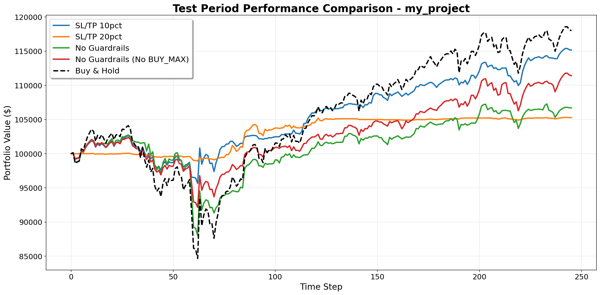
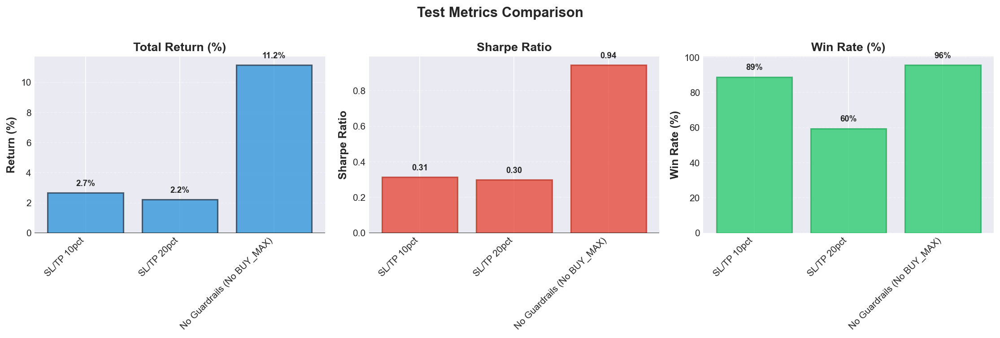

# DQN Trading System - Deep Reinforcement Learning for Stock Trading

A professional implementation of Deep Q-Network (DQN) for stock trading with Double DQN, Dueling architecture, intelligent position sizing, and comprehensive risk management.

## ⚠️ Disclaimer

**This project is for educational and research purposes only.** The code and strategies presented should not be considered financial advice, investment advice, or trading advice. Trading stocks and financial instruments involves substantial risk of loss and is not suitable for every investor. Past performance of backtested strategies does not guarantee future results. The author is not responsible for any financial losses incurred from using this code. Always consult with a qualified financial advisor before making investment decisions.

## Table of Contents

1. [Executive Summary](#executive-summary)
2. [Quick Start](#quick-start)
3. [Project Structure](#project-structure)
4. [Configuration System](#configuration-system)
5. [Storage Structure](#storage-structure)
6. [Core Trading Mechanics](#core-trading-mechanics)
7. [Reward System Design](#reward-system-design)
8. [DQN Architecture](#dqn-architecture)
9. [Data Pipeline](#data-pipeline)
10. [Training Pipeline](#training-pipeline)
11. [Performance Monitoring](#performance-monitoring)
12. [Results & Metrics](#results--metrics)
13. [Advanced Usage](#advanced-usage)
14. [Technical References](#technical-references)

---

## Executive Summary

### What This System Does
This system trains an AI agent to make stock trading decisions (Buy/Hold/Sell) with flexible position sizing using Deep Reinforcement Learning. The agent learns to maximize absolute profit while managing risk through stop-loss and take-profit mechanisms.

### Key Differentiators
- **Log Return Rewards**: Uses logarithmic returns for time-additive, symmetric, and statistically robust reward signals that reduce outlier sensitivity
- **BUY_MAX Action**: Price-adaptive position sizing - agent can go "all-in" based on available balance, no arbitrary limits
- **Smart Data Caching**: Intelligent caching system prevents redundant API calls
- **Comprehensive Monitoring**: Real-time logging and configuration management

### Core Capabilities
| Feature | Description |
|---------|-------------|
| **Position Sizing** | Flexible position sizing with BUY_MAX and incremental buys |
| **Risk Management** | Stop-loss (20%) and take-profit (20%) guardrails |
| **Architecture** | Double DQN with Dueling networks |
| **Action Masking** | Prevents invalid actions (insufficient balance, etc.) |
| **Data Features** | 25+ technical indicators with rolling normalization |
| **Validation** | Out-of-sample validation on random non-overlapping periods |

---

## Quick Start

### 1. Fastest Test (< 1 minute)
```bash
# Install and run dry test
pip install -r requirements.txt
jupyter notebook main.ipynb

# In notebook:
# - Set PROJECT_FOLDER = 'dry_run'
# - Set TEST_MODE = False
# - Run all cells (Cell → Run All)
```

### 2. Monitor Training (Live)
```bash
# In another terminal while training:
python monitor_training.py --run <run_name>

# Output:
# 🔄 LIVE TRAINING MONITOR - dry_run_SPY_20260118_094530
# ⏱️  Runtime: 15.3 minutes
# 📈 Episode 45/100
#   • Return: $12,340 (12.34%)
#   • Win Rate: 55.23%
```

### 3. Full Training (30-60 minutes)
```bash
# In notebook:
PROJECT_FOLDER = 'default_run'  # 100 episodes, 10 years data
TEST_MODE = False  # Train from scratch
```

### 4. Test Mode (skip training if models exist)
```bash
# In notebook:
PROJECT_FOLDER = 'default_run'
TEST_MODE = True  # Load existing models for testing only
```

---

## Project Structure

### Configuration Folders
```
config/
├── dry_run/                      # Quick test project (1 episode, 2 years data)
│   ├── data_config.json         # Data settings (ticker, dates, splits)
│   └── trading_dry_run.json     # Strategy config with strategy_name
└── default_run/                  # Full training project (100 episodes, 10 years)
    ├── data_config.json
    └── trading_baseline.json
```

### Source Code Organization
```
src/
├── data/
│   ├── collector.py         # Smart caching - downloads once, reuses cached data
│   └── splitter.py          # Train/validation/test splitting
├── features/
│   ├── engineer.py          # 25+ technical indicators
│   └── normalizer.py        # Rolling Z-score normalization
├── models/
│   ├── dqn.py              # TensorFlow/Keras Double DQN + Dueling
│   └── action_masking.py   # Prevents invalid trades
├── trading/
│   ├── environment.py      # OpenAI Gym-style trading env
│   └── guardrails.py       # Stop-loss & take-profit
├── training/
│   ├── trainer.py          # Training orchestration
│   └── replay_buffer.py    # Experience replay
├── evaluation/
│   ├── validator.py        # Out-of-sample validation
│   └── metrics.py          # Performance metrics
└── utils/
    ├── config_loader.py    # Loads & validates configs
    └── model_manager.py    # TensorFlow model saving/loading
```

---

## Configuration System

📚 **[Complete Configuration Parameters Reference → CONFIG_PARAMETERS.md](CONFIG_PARAMETERS.md)**

### Two-Part Configuration Structure

Each project folder contains:
1. **`data_config.json`** - Data-related settings (shared across strategies)
2. **`trading_*.json`** - Strategy-specific settings

#### Example `data_config.json`:
```json
{
  "ticker": "SPY",
  "start_date": "2024-01-01",
  "end_date": "2025-12-31",
  "data": {
    "window_size": 5,
    "normalization_window": 30,
    "indicators": {
      "bollinger_period": 20,
      "rsi_period": 14,
      // ... more indicators
    }
  },
  "validation": {
    "n_periods": 2,
    "period_unit": "month",
    "random_seed": 42
  },
  "test": {
    "period_duration": 2,
    "period_unit": "month"
  }
}
```

#### Example `trading_*.json`:
```json
{
  "experiment_name": "baseline",
  "strategy_name": "Baseline (20% SL/TP)",  // Used in plot legends
  "trading": {
    "share_increments": [1, 5, 10],
    "starting_balance": 100000,
    "stop_loss_pct": 20,
    "take_profit_pct": 20
  },
  "network": {
    "architecture": "dueling",
    "shared_layers": [256, 128]
  },
  "training": {
    "episodes": 100,
    "save_frequency": 10,  // Save model every 10 episodes
    "learning_rate": 0.001
  }
}
```

---

## Storage Structure

### Models (TensorFlow .h5 files)
```
models/
├── dry_run/
│   └── dry_run/                  # {project}/{experiment_name}
│       ├── model_episode_001.h5  # Checkpoint (based on save_frequency)
│       ├── final_model.h5        # Final model
│       └── metadata.json         # Training info
└── default_run/
    └── baseline/
        ├── model_episode_010.h5  # Saved every 10 episodes
        ├── model_episode_020.h5
        ├── ...
        └── final_model.h5
```

**Model Saving Frequency:**
- Controlled by `save_frequency` in trading config
- `dry_run`: Every 1 episode (only has 1 episode)
- `default_run`: Every 10 episodes
- Final model always saved at end

### Results
```
results/
├── dry_run/
│   └── run_20260118_094530/     # Timestamped run folder
│       ├── final_results.json   # All metrics and history
│       ├── figure_*.png         # All plots
│       └── test_comparison.csv  # Strategy comparison table
└── default_run/
    └── run_20260118_103045/
        └── ...
```

### Logs (Real-time monitoring)
```
logs/
├── dry_run/
│   └── dry_run_SPY_20260118_094530/
│       ├── progress.json        # Training stages
│       └── metrics.json         # Episode metrics
└── default_run/
    └── ...
```

### Data Cache (Shared across all projects)
```
data/
├── SPY_20240101_20251231.csv   # Downloaded once, reused
└── VIX_20240101_20251231.csv   # Smart caching prevents redundant downloads
```

**Smart Caching Features:**
- First run: Downloads from Yahoo Finance
- Subsequent runs: Detects cache, prints "Using cached data"
- Cache key: `{TICKER}_{YYYYMMDD}_{YYYYMMDD}.csv`
- Automatic date range detection

---

## Creating Custom Projects

### Step 1: Create Project Folder
```bash
mkdir config/my_project
```

### Step 2: Create Data Config
```json
# config/my_project/data_config.json
{
  "ticker": "BTC-USD",
  "start_date": "2020-01-01",
  "end_date": "2024-12-31",
  "data": {
    "window_size": 5,
    "normalization_window": 30,
    "indicators": { ... }
  },
  "validation": {
    "n_periods": 3,
    "period_unit": "year"
  },
  "test": {
    "period_duration": 1,
    "period_unit": "year"
  }
}
```

### Step 3: Add Trading Strategies
You can add multiple trading strategies to compare:

```json
# config/my_project/trading_aggressive.json
{
  "experiment_name": "aggressive",
  "strategy_name": "Aggressive (10% SL, 30% TP)",
  "trading": {
    "share_increments": [10, 50, 100, 200],
    "enable_buy_max": false,
    "stop_loss_pct": 10,
    "take_profit_pct": 30,
    "starting_balance": 100000,
    "idle_reward": -0.001,
    "buy_transaction_cost_per_share": 0.01,
    "sell_transaction_cost_per_share": 0.01
  },
  "network": {
    "architecture": "dueling",
    "shared_layers": [256, 128],
    "value_layers": [128],
    "advantage_layers": [128]
  },
  "training": {
    "episodes": 500,
    "batch_size": 64,
    "learning_rate": 0.001
  }
}

# config/my_project/trading_conservative.json
{
  "experiment_name": "conservative",
  "strategy_name": "Conservative (30% SL, 10% TP)",
  "trading": {
    "share_increments": [10, 50, 100, 200],
    "enable_buy_max": false,
    "stop_loss_pct": 30,
    "take_profit_pct": 10,
    "starting_balance": 100000,
    "idle_reward": -0.001,
    "buy_transaction_cost_per_share": 0.01,
    "sell_transaction_cost_per_share": 0.01
  },
  "network": {
    "architecture": "dueling",
    "shared_layers": [256, 128],
    "value_layers": [128],
    "advantage_layers": [128]
  },
  "training": {
    "episodes": 500,
    "batch_size": 64,
    "learning_rate": 0.001
  }
}
```

### Step 4: Run in Notebook
```python
PROJECT_FOLDER = 'my_project'
TEST_MODE = False
# Run all cells - will train and compare both strategies
```

---

## Core Trading Mechanics

### Action Space

The agent's action space is determined by `share_increments` configuration:

**Formula:** `n_actions = 1 + N + 1 + N + 1` where N = len(share_increments)

**Action Structure:**
- Action 0: HOLD
- Actions 1 to N: BUY actions (one for each increment)
- Action N+1: BUY_MAX (buy as many shares as balance allows)
- Actions N+2 to 2N+1: SELL actions (one for each increment)
- Action 2N+2: SELL_ALL

| share_increments | Actions (with BUY_MAX) | Actions (without BUY_MAX) | Description |
|------------------|----------------------|--------------------------|-------------|
| [1] | 5 | 4 | HOLD, BUY_1, [BUY_MAX], SELL_1, SELL_ALL |
| [1, 5, 10] | 9 | 8 | HOLD, BUY_1, BUY_5, BUY_10, [BUY_MAX], SELL_1, SELL_5, SELL_10, SELL_ALL |
| [10, 50, 100] | 9 | 8 | HOLD, BUY_10, BUY_50, BUY_100, [BUY_MAX], SELL_10, SELL_50, SELL_100, SELL_ALL |
| [10, 50, 100, 200] | 11 | 10 | HOLD, BUY_10, BUY_50, BUY_100, BUY_200, [BUY_MAX], SELL_10, SELL_50, SELL_100, SELL_200, SELL_ALL |
| [25, 50, 75, 100] | 11 | 10 | HOLD + 4 buys + [BUY_MAX] + 4 sells + SELL_ALL |

**Key Features:**

**BUY_MAX Action:**
- Buys as many shares as the current balance allows
- Adaptive to price changes (at $400 vs $500, different quantities)
- No arbitrary position size limits
- Natural capital allocation

**Multi-Buy Accumulation:**
- Agent can buy multiple times using increments or BUY_MAX
- Position tracked with weighted average entry price
- Guardrails (SL/TP) based on weighted average

**Partial Sells with FIFO:**
- Agent can sell portions of position (Sell10, Sell50, etc.)
- Shares removed using FIFO (First-In-First-Out)
- Profit calculated per-lot
- SELL_ALL always available when holding shares

**Benefits:**
- No arbitrary max_shares constraint
- Price-adaptive position sizing
- Symmetric design (BUY_MAX mirrors SELL_ALL)
- Realistic trading behavior (scale in/out)
- Agent learns strategic position building

### Trading Rules

1. **Position Management**
   - Agent can accumulate position through multiple BUY actions
   - Position tracked with weighted average entry price
   - Agent can sell portions using incremental SELL actions (FIFO)
   - SELL_ALL always available when holding shares
   - Invalid actions are masked during training

2. **Risk Controls**
   - **Stop-Loss**: Configurable % (10%, 20%, or 100% to disable)
   - **Take-Profit**: Configurable % (10%, 20%, or 10,000% to disable)
   - **Transaction Costs**: $0.01 per share on both buy and sell
   - **Idle Penalty**: -0.001 reward per step to encourage active trading

3. **State Representation**
   ```python
   State Shape: (window_size, n_features + 2)
   - Features: 25 technical indicators (normalized)
   - Position: shares_held / max_affordable_shares
   - Balance: current_balance / starting_balance
   ```

---

## Reward System Design

### Critical Design Choice: Log Returns vs Simple Returns

**Why Log Returns Are Superior:**

Log returns offer several mathematical and practical advantages over simple percentage returns:

1. **Time-Additivity (Compound Growth)**
   - Simple returns: 10% + 10% = 20% (incorrect for compounding)
   - Log returns: log(1.1) + log(1.1) = log(1.21) ≈ 19.06% (correct!)

2. **Symmetry of Gains/Losses**
   - Simple: -50% loss requires +100% gain to break even (asymmetric)
   - Log: -69.3 vs +69.3 (more balanced representation)

3. **Outlier Compression**
   - Reduces extreme reward spikes that can destabilize RL training
   - 200% gain isn't treated as 4x more valuable than 50% gain

4. **Better Statistical Properties**
   - Closer to normal distribution → better neural network gradients
   - Standard practice in quantitative finance

### Reward Function Implementation

```python
# IDLE/HOLD Action
reward = idle_reward  # Default: -0.001 (small penalty for inaction)

# BUY Action
buy_reward = buy_reward_per_share * shares_bought  # Encourage/discourage buying
transaction_penalty = -buy_transaction_cost_per_share * shares_bought  # Fixed cost per share
reward = buy_reward + transaction_penalty
# Example: Buy 10 shares, reward = 0, cost = -$0.10, total = -$0.10

# SELL Action (CRITICAL - Log Return)
gross_profit = (sell_price - buy_price) * shares_held
total_transaction_cost = (buy_cost_per_share + sell_cost_per_share) * shares_held
net_profit = gross_profit - total_transaction_cost
position_value = buy_price * shares_held
simple_return = net_profit / position_value
reward = log(1 + simple_return) * 100  # Log return scaled for readability

# Example: Buy 10 shares at $100, sell at $110
# Gross profit = $100, transaction costs = $0.20
# Net profit = $99.80, position value = $1000
# Simple return = 0.0998 (9.98%)
# Reward = log(1.0998) * 100 ≈ 9.51 (log return)
```

### Comparison: Simple vs Log Returns

| Trade Return | Simple % | Log Reward | Difference |
|--------------|----------|------------|------------|
| +10% | +10.00 | +9.53 | -4.7% |
| +50% | +50.00 | +40.55 | -18.9% |
| +100% | +100.00 | +69.31 | -30.7% |
| -50% | -50.00 | -69.31 | +38.6% |
| -90% | -90.00 | -230.26 | +155.8% |

**Key Insight:** Log returns compress large gains and amplify large losses, encouraging the agent to avoid catastrophic losses while still pursuing reasonable gains.

### Why This Matters

The log return reward ensures the agent learns:
1. **When to trade** (market timing)
2. **How much to trade** (position sizing through trial and error)
3. **Risk/reward tradeoffs** (losses hurt more, extreme gains compressed)
4. **Stable training** (reduced variance, better convergence)

---

## DQN Architecture

### Double DQN with Dueling Networks

```
Input State (27 features)
    ↓
[Shared Layers: 256 → 128]
    ↓
    ├── [Value Stream]      → V(s)
    │     128 → 1
    │
    └── [Advantage Stream]  → A(s,a)
          128 → n_actions
            ↓
    Q(s,a) = V(s) + A(s,a) - mean(A)
```

### Key Components

1. **Q-Network (Behavior Network)**
   - Selects actions during training
   - Updated every batch via gradient descent

2. **Target Network**
   - Provides stable Q-value targets
   - Updated every episode (configurable via `target_update_freq`)

3. **Experience Replay Buffer**
   - Stores (state, action, reward, next_state, done) tuples
   - Size: 10,000 transitions
   - Batch size: 32

4. **Action Masking**
   - Enforces valid actions only
   - Masks Q-values for invalid actions to -∞

### Network Configuration

```json
"network": {
  "architecture": "dueling",     // "dueling" or "standard"
  "shared_layers": [256, 128],   // Shared network layers
  "value_layers": [128],          // Value stream (dueling only)
  "advantage_layers": [128],      // Advantage stream (dueling only)
  "activation": "relu",           // Activation function
  "dropout_rate": 0.0,           // Dropout for regularization
  "batch_norm": false            // Batch normalization
}
```

---

## Data Pipeline

### 1. Data Collection & Caching

**Smart Caching System:**
```
Files: ticker_YYYYMMDD_YYYYMMDD.csv
Example: SPY_20200101_20231231.csv

Logic:
- Check if existing cache covers requested dates
- Only download missing data
- Merge intelligently
```

### 2. Feature Engineering (25+ Features)

**Price Features:**
- Returns: 1-day, 5-day
- Log returns
- Price ratios: High/Low, Close/Open
- Rolling statistics: mean, std (30-day window)

**Technical Indicators:**
| Indicator | Parameters | Purpose |
|-----------|------------|---------|
| Bollinger Bands | 20-day, 2σ | Volatility & mean reversion |
| RSI | 14-day | Overbought/oversold conditions |
| MACD | 12/26/9 | Trend following |
| ADX | 14-day | Trend strength |
| EMAs | 8, 21 | Short-term trends |
| SMAs | 50, 200 | Long-term trends |

**Volume Features:**
- Volume ratio (current/average)
- On-Balance Volume (OBV)
- Volume-Price Trend (VPT)

**Market Regime:**
- VIX level and change

### 3. Data Splitting Strategy (BEFORE Normalization)

**Critical: Split FIRST to prevent lookahead bias!**

```
Total Data (10 years)
├── Training Set (~80%)
│   └── Used for DQN training
│
├── Validation Set (N random periods)
│   └── Random non-overlapping months
│   └── For hyperparameter tuning
│
└── Test Set (Final period)
    └── Held out for final evaluation
```

### 4. Data Normalization (Continuous Timeline, Industry Standard)

**Rolling Z-Score Normalization (Stateful, Backward-Only):**
```python
# Applied AFTER splitting but on CONTINUOUS TIMELINE
# Industry-standard approach for backtesting and live-trading simulation

normalized[t] = (value[t] - rolling_mean[t-30:t-1]) / rolling_std[t-30:t-1]

Process:
1. Reconstruct chronological timeline from all splits
2. Apply rolling normalization (window=30 days, backward-only)
3. Extract normalized train/val/test using original indices

Key Properties:
- Window: 30 days (backward-only, center=False)
- At time t, uses stats from [t-30, t-1] ONLY
- Validation rolling window CAN include train data (realistic!)
- Test rolling window CAN include train+val data (realistic!)
- Original values preserved with '_orig' suffix
```

**Why Continuous Timeline Normalization?**
- ✅ **Simulates real production:** In live trading, you'd have all historical data
- ✅ **No lookahead bias:** Each point only uses PRIOR data (backward rolling)
- ✅ **Consistent statistics:** No distribution shift across splits
- ✅ **Industry standard:** How professional backtests are done
- ✅ **Deploy-ready:** Exactly mirrors production feature pipeline
    └── Never seen during training
    └── Final performance evaluation
```

**Validation Periods:**
- Randomly selected months
- Non-overlapping (no data reuse)
- Ensures temporal robustness

---

## Installation & Setup

### Requirements
- Python 3.8+
- TensorFlow 2.x
- 4GB RAM minimum
- 1GB disk space

### Installation Steps

```bash
# 1. Clone repository
git clone https://github.com/yourusername/dqn-trading.git
cd dqn-trading

# 2. Create virtual environment
python -m venv venv
source venv/bin/activate  # Windows: venv\Scripts\activate

# 3. Install dependencies
pip install -r requirements.txt

# 4. Launch notebook
jupyter notebook main.ipynb
```

---

## Training Pipeline

### Training Process

1. **Initialization**
   - Load configuration
   - Collect & cache market data
   - Create technical indicators
   - Initialize DQN networks

2. **Episode Loop**
   ```python
   for episode in range(episodes):
       state = env.reset()
       while not done:
           # Epsilon-greedy action selection
           if random() < epsilon:
               action = random_valid_action()
           else:
               action = dqn.predict(state)

           # Execute and store
           next_state, reward, done = env.step(action)
           replay_buffer.add(state, action, reward, next_state)

           # Train on batch
           if len(replay_buffer) >= batch_size:
               batch = replay_buffer.sample(batch_size)
               dqn.train(batch)
   ```

3. **Validation**
   - Test on random hold-out periods
   - No exploration (epsilon = 0)
   - Track performance metrics

4. **Final Testing**
   - Evaluate on final unseen period
   - Compare vs Buy & Hold baseline

### Output Files

```
models/
  └── SPY_20260118_094530_ep100.h5      # Trained model

results/
  └── results_SPY_20260118_094530.json  # Performance metrics

logs/SPY_20260118_094530/
  ├── progress.json    # Training progress
  ├── metrics.csv      # Episode metrics
  └── summary.json     # Final summary

data/
  ├── SPY_20160101_20251231.csv  # Cached price data
  └── VIX_20160101_20251231.csv  # Cached VIX data
```

---

## Performance Monitoring

### Live Monitoring During Training

```bash
python monitor_training.py

# Commands:
--list              # Show all training runs
--run RUN_ID        # Monitor specific run
--refresh SECONDS   # Update frequency (default: 5)

# Output:
═══════════════════════════════════════════
🔄 LIVE TRAINING MONITOR - SPY_20260118_094530
═══════════════════════════════════════════
📊 Configuration:
  • Ticker: SPY
  • Episodes: 100
  • Share Increments: [1, 5, 10]

⏱️  Runtime: 25.7 minutes
📈 Episode 67/100 (67.0%)
  • Episode Return: $3,450 (3.45%)
  • Total Profit: $45,230
  • Win Rate: 58.3%
  • Sharpe Ratio: 1.23
  • Max Drawdown: -8.5%

🏆 Best Episode: 45 (Return: 4.12%)
💾 Last Save: Episode 60
```

### Metrics Tracked

| Metric | Description |
|--------|-------------|
| Total Return | Portfolio value change |
| Total Profit | Sum of all profitable trades |
| Win Rate | % of profitable trades |
| Sharpe Ratio | Risk-adjusted returns |
| Max Drawdown | Largest peak-to-trough loss |
| Trade Count | Number of completed trades |

---

## Results & Metrics

### Campaign: `my_project`

A comprehensive evaluation of DQN trading agents on SPY (S&P 500 ETF) comparing risk management strategies and adaptive position sizing.

**Configuration:**
- **Ticker:** SPY
- **Data Period:** 2005-01-01 to 2025-12-31 (21 years)
- **Training Data:** 2006-01-03 to 2024-12-27 (3,772 samples, ~19 years)
- **Starting Capital:** $100,000
- **Share Increments:** [10, 50, 100, 200]
- **Transaction Costs:** $0.01 per share (buy and sell)
- **Idle Reward:** -0.001 per step (encourages active trading)
- **Network Architecture:** Dueling DQN with [256, 128] shared layers, [128] value/advantage layers
- **Training Episodes:** 500 per strategy (~2 hours per strategy)
- **Training Hyperparameters:**
  - Batch size: 64
  - Replay buffer: 10,000 transitions
  - Learning rate: 0.001 (Adam optimizer)
  - Gamma (discount): 0.99
  - Epsilon decay: 0.995 (1.0 → 0.01)
  - Target network update: Every 5 episodes

**Four Strategies Compared:**

1. **SL/TP 10pct** (`enable_buy_max: false`)
   - 10% stop-loss and 10% take-profit (tight risk control)
   - No BUY_MAX action (10 total actions: HOLD + 4 BUY + 4 SELL + SELL_ALL)
   - Forces precise position sizing decisions with incremental buys

2. **SL/TP 20pct** (`enable_buy_max: false`)
   - 20% stop-loss and 20% take-profit (balanced risk/reward)
   - No BUY_MAX action (10 total actions)
   - Wider guardrails allow more room for price movement

3. **No Guardrails** (`enable_buy_max: true`)
   - Stop-loss: 100%, Take-profit: 10,000% (effectively disabled)
   - Includes BUY_MAX action (11 total actions: HOLD + 4 BUY + BUY_MAX + 4 SELL + SELL_ALL)
   - Pure DQN decision-making with adaptive position sizing via BUY_MAX

4. **No Guardrails (No BUY_MAX)** (`enable_buy_max: false`)
   - Stop-loss: 100%, Take-profit: 10,000% (effectively disabled)
   - No BUY_MAX action (10 total actions)
   - Pure DQN with manual position sizing using only incremental actions

**Configuration Files:**

All strategies share the same network architecture and training hyperparameters, differing only in risk management settings:

```json
// Common to all strategies
{
  "trading": {
    "share_increments": [10, 50, 100, 200],
    "starting_balance": 100000,
    "idle_reward": -0.001,
    "buy_reward_per_share": 0.0,
    "buy_transaction_cost_per_share": 0.01,
    "sell_transaction_cost_per_share": 0.01
  },
  "network": {
    "architecture": "dueling",
    "shared_layers": [256, 128],
    "value_layers": [128],
    "advantage_layers": [128],
    "activation": "relu"
  },
  "training": {
    "episodes": 500,
    "batch_size": 64,
    "replay_buffer_size": 10000,
    "learning_rate": 0.001,
    "gamma": 0.99,
    "epsilon_decay": 0.995
  }
}

// Strategy-specific differences:
// SL/TP 10pct:  stop_loss_pct: 10,  take_profit_pct: 10,    enable_buy_max: false
// SL/TP 20pct:  stop_loss_pct: 20,  take_profit_pct: 20,    enable_buy_max: false
// No Guardrails: stop_loss_pct: 100, take_profit_pct: 10000, enable_buy_max: true
// No Guardrails (No BUY_MAX): stop_loss_pct: 100, take_profit_pct: 10000, enable_buy_max: false
```

### Out-of-Sample Validation Results

The trained models were evaluated on **5 randomly selected out-of-sample validation periods** spanning different market regimes. These periods were **never seen during training**:

- **Period 1 (2005-02-08 to 2005-12-30)** - Pre-financial crisis bull market
- **Period 2 (2008-01-02 to 2008-12-31)** - Global financial crisis (extreme volatility)
- **Period 3 (2012-01-03 to 2012-12-31)** - Post-crisis recovery
- **Period 4 (2013-01-02 to 2013-12-31)** - Bull market continuation
- **Period 5 (2021-01-04 to 2021-12-31)** - Post-COVID recovery


*Out-of-sample validation metrics across 5 random periods, including Returns, Sharpe Ratio, Sortino Ratio, Win Rate, Number of Trades, and Position Size Distribution.*

**Key Validation Insights (Average Across 5 Periods):**

| Strategy | Avg Return | Avg Sharpe | Avg Sortino | Actions |
|----------|------------|------------|-------------|---------|
| **No Guardrails (No BUY_MAX)** | **6.55%** | **1.02** | **1.48** | 10 |
| SL/TP 10pct | 5.16% | 0.95 | 1.46 | 10 |
| SL/TP 20pct | 4.48% | 0.95 | 1.35 | 10 |
| No Guardrails | 2.37% | 1.01 | 1.34 | 11 |

**Analysis:**
- **Best Risk-Adjusted:** No Guardrails (No BUY_MAX) achieved the best average Sharpe (1.02) and Sortino (1.48) ratios across all validation periods
- **BUY_MAX Impact:** Strategies without BUY_MAX (10 actions) demonstrated more consistent performance with superior downside risk management (higher Sortino), suggesting that incremental position sizing [10, 50, 100, 200] allows for better risk control than adaptive BUY_MAX
- **Guardrail Trade-off:** Removing guardrails allows DQN to learn more nuanced exit strategies, but requires careful position sizing discipline
- **Crisis Period (2008):** All strategies experienced significant drawdowns, highlighting the challenge of bear market navigation
- **Bull Markets (2013, 2021):** Strategies showed strong performance with returns of 14-26%, demonstrating ability to capitalize on uptrends

### Test Set Performance

Final evaluation on held-out test period (2024-12-30 to 2025-12-30, 251 samples) comparing against Buy & Hold baseline (17.99% return):



*Portfolio value over time showing DQN strategies vs Buy & Hold baseline. Note that Buy & Hold now correctly shows actual market volatility (buying max shares at start with remaining cash buffer) rather than linear interpolation.*



*Comprehensive test metrics including Returns, Sharpe Ratio, Sortino Ratio, Win Rate, Max Drawdown, and Position Size Distribution.*

**Test Results Summary:**

| Strategy | Return | Sharpe | Sortino | Max DD | Win Rate | Trades | Actions |
|----------|--------|--------|---------|--------|----------|--------|---------|
| **SL/TP 10pct** | **15.16%** | **1.63** | **2.32** | **-6.80%** | **82.98%** | **141** | 10 |
| No Guardrails (No BUY_MAX) | 11.42% | 1.11 | 1.43 | -9.99% | 94.29% | 70 | 10 |
| No Guardrails | 6.70% | 0.56 | 0.60 | -14.31% | 69.20% | 224 | 11 |
| SL/TP 20pct | 5.27% | 1.63 | 2.36 | -1.57% | 71.43% | 42 | 10 |
| Buy & Hold | 17.99% | N/A | N/A | N/A | N/A | N/A | N/A |

**Analysis:**
- **Winner:** SL/TP 10pct (10% SL/TP, no BUY_MAX, 10 actions) achieved the best DQN performance with 15.16% return, 1.63 Sharpe, and 2.32 Sortino ratio, coming close to Buy & Hold (17.99%)
- **Risk Management:** Tight stop-loss strategies (10% and 20%) demonstrated superior risk-adjusted returns with Sharpe ratios of 1.63 and minimal drawdowns (-6.80% and -1.57%)
- **Downside Protection:** Sortino ratios of 2.32-2.36 for SL/TP strategies indicate excellent downside risk management, prioritizing protection against negative returns
- **Trading Efficiency:** No Guardrails (No BUY_MAX) achieved 94.29% win rate with only 70 trades, demonstrating quality over quantity with incremental position sizing [10, 50, 100, 200]
- **Guardrail Impact:** Strategies with stop-loss/take-profit guardrails significantly outperformed those without, validating the importance of automated risk management
- **BUY_MAX Trade-off:** All top 3 performers disabled BUY_MAX, suggesting that forcing explicit position sizing decisions through incremental actions leads to better risk-adjusted returns than adaptive all-in positioning
- **Action Space:** The 10-action strategies (without BUY_MAX) dominated performance, suggesting a simpler action space with forced incremental sizing improves learning efficiency

### Expected Performance

| Configuration | Episodes | Training Time | Annual Return | Sharpe Ratio | Win Rate |
|---------------|----------|---------------|---------------|--------------|----------|
| Dry Run | 1 | < 1 min | -2% to +2% | -0.5 to 0.5 | 30-50% |
| Default | 100 | 30-60 min | 5-15% | 0.5-1.5 | 45-55% |
| Optimized | 500 | 3-5 hours | 10-25% | 1.0-2.0 | 50-60% |

### Performance Analysis

The system outputs comprehensive metrics:

```json
{
  "test_metrics": {
    "total_return": 0.1234,      // 12.34% return
    "total_profit": 12340,        // $12,340 profit
    "num_trades": 145,            // 145 completed trades
    "win_rate": 0.523,            // 52.3% profitable
    "sharpe_ratio": 1.45,         // Risk-adjusted return
    "max_drawdown": -0.087,       // -8.7% max drawdown
    "avg_trade_profit": 85.1,     // $85.1 per trade
    "avg_position_size": 7.3      // Average shares traded
  },
  "vs_baseline": {
    "buy_hold_return": 0.089,     // 8.9% buy & hold
    "outperformance": 0.0344      // 3.44% alpha
  }
}
```

---

## Advanced Usage

### Custom Network Architectures

**Deep Network (More Capacity):**
```json
{
  "network": {
    "architecture": "dueling",
    "shared_layers": [512, 256, 128],
    "value_layers": [256, 128],
    "advantage_layers": [256, 128],
    "dropout_rate": 0.2,
    "batch_norm": true
  }
}
```

**Fast Network (Quick Training):**
```json
{
  "network": {
    "architecture": "standard",
    "shared_layers": [128, 64],
    "activation": "elu"
  }
}
```

### Trading Strategies

**Conservative (Low Risk):**
```json
{
  "trading": {
    "share_increments": [1],
    "stop_loss_pct": 0.10,
    "take_profit_pct": 0.15,
    "idle_reward": -0.002,
    "buy_reward_per_share": -0.01
  }
}
```

**Aggressive (High Risk/Reward):**
```json
{
  "trading": {
    "share_increments": [10, 50, 100],
    "stop_loss_pct": 0.30,
    "take_profit_pct": 0.40,
    "idle_reward": 0.0,
    "buy_reward_per_share": 0.01
  }
}
```

### Custom Features

Add indicators in `src/features/engineer.py`:
```python
def create_features(self, data):
    # Add custom indicator
    data['custom_indicator'] = your_calculation(data)
    return data
```

---

## Technical References

### Core Papers
- [Double DQN (2015)](https://arxiv.org/abs/1509.06461) - Reduces Q-value overestimation
- [Dueling DQN (2015)](https://arxiv.org/abs/1511.06581) - Separates value and advantage
- [Rainbow DQN (2017)](https://arxiv.org/abs/1710.02298) - Combines DQN improvements

### Key Concepts

**Double DQN:**
- Uses two networks to decouple action selection from evaluation
- Reduces overestimation bias in Q-learning

**Dueling Architecture:**
- Separates state value V(s) from action advantages A(s,a)
- Better learning in states where action choice doesn't matter much

**Experience Replay:**
- Stores and reuses past experiences
- Breaks correlation between consecutive samples
- Enables more stable training

---

## Troubleshooting

### Common Issues

**Out of Memory:**
```json
{
  "training": {
    "batch_size": 16,
    "replay_buffer_size": 5000
  }
}
```

**Training Too Slow:**
- Reduce episodes
- Use smaller network
- Decrease window_size

**Poor Performance:**
- Increase episodes (200-500)
- Tune epsilon decay
- Adjust reward_type to "absolute"
- Check data quality

### Getting Help

- GitHub Issues: Report bugs and request features
- Documentation: This README and inline code comments
- Monitoring: Use `monitor_training.py` to diagnose

---

## License

MIT License - See LICENSE file for details

## Contributing

Contributions welcome! Please open an issue or submit a pull request.